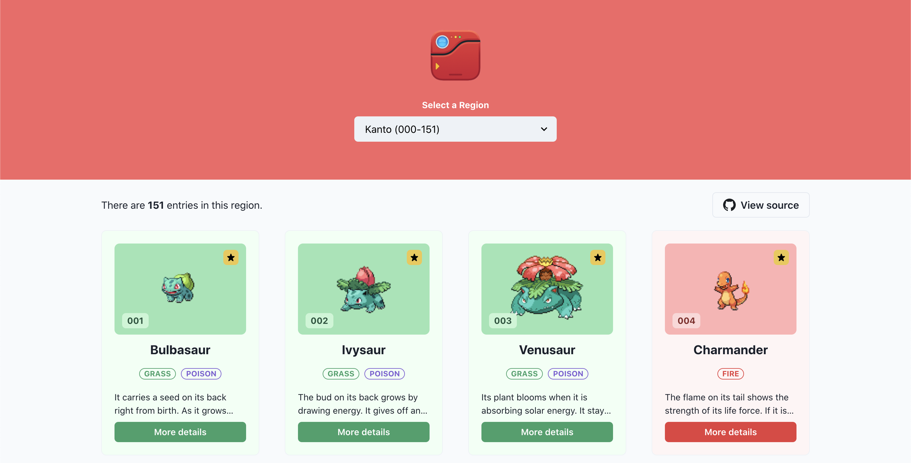

# PokéDex

A ReactJS application that uses the <a href="https://chakra-ui.com/">Chakra UI</a> library and the <a href="https://pokeapi.co/">PokéAPI</a> for its REST API.

## Screenshot

## Live Demo

https://pokedex-chakra-ui.netlify.app/
